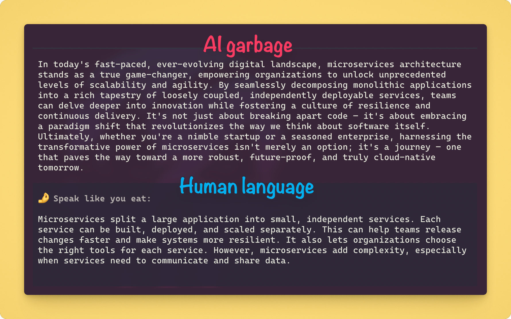

# SLYE - Speak like you eat

<p align="center">
  
</p>

<h6 align="center"><i>Translate AI garbage to human language</i></h6>

SLYE is a Pi package that adds a plain-language rewrite after a completed response.

In Italian, “speak like you eat” (*parla come mangi*) means being straightforward instead of using big, clever, empty words. SLYE applies that idea to AI output.

*Deliberately inspired by [Claudish to English](https://github.com/gvzdv/claudish-to-english)*

## Install

```sh
# Install this fork for all projects
pi install git:github.com/himym1/speak-like-you-eat

# Install this fork only in the current project
pi install -l git:github.com/himym1/speak-like-you-eat
```

This fork is installed from Git and is not published to npm. Package release metadata remains compatible with the upstream Release Please workflow.

## Use

1. Run `/slye model` to select and save an authenticated model. SLYE enables it and saves it globally or, in a trusted project, locally.
2. Chat normally. After an eligible answer, read the `🤌 Speak like you eat:` card below the original.
3. Run `/slye original hide` to show only successful rewrite cards, or `/slye original show` to restore originals.
4. Use `/slye off` later to disable SLYE and `/slye on` to restore it.

| Command | What it does |
| --- | --- |
| `/slye model` | Choose a model; Tab switches between scoped and all authenticated eligible models. |
| `/slye on` | Enable SLYE or open the picker when no usable model is saved. |
| `/slye off` | Disable SLYE. |
| `/slye original hide` | Hide originals after their rewrite card is safely appended. |
| `/slye original show` | Show original responses again without restarting Pi. |
| `/slye original status` | Show the effective original-response display setting. |

SLYE automatically uses the selected model's lowest supported thinking level. Only normally completed final responses with at least 200 prose characters outside fenced code are eligible.

### Recommended models

I ran a small, human-scored benchmark (me) to see how different cheap AI models would handle the "translation" part.

But long story short, use cheap-ish, fast models with low/no reasoning (SLYE already sets reasoning for you).

Models that I recommend:

- **Terra** - best overall in this benchmark but not the fastest
- **DeepSeek V4 Flash** - fast, good accuracy
- **GPT-OSS 120B** - cheapest of the three with good overall results, but more sensitive to prompt wording in this small benchmark

## What SLYE guarantees

- The original response always remains unchanged in the session and LLM context. It is visible by default.
- With `hideOriginal` enabled, SLYE hides matching finalized Assistant Markdown only after the rewrite card is appended. Streaming, cancelled, timed-out, failed, and unrewritten responses stay visible.
- Display-only rewrite cards and original hiding never enter LLM context.
- SLYE's rewrite request tells the model to preserve the target response's language and intentional language mix rather than translate it.
- Each eligible response makes one additional provider request, with its own cost and latency.
- Escape cancels a rewrite. After 45 seconds or another failure, SLYE leaves the original alone and fails open.
- SLYE sends an isolated, SLYE-controlled payload directly to the selected provider. It does not load project instructions, skills, prompts, tools, files, or the full session history. Other extensions and provider-side processing are outside SLYE's control.

### Original-display limitation

Pi's display transformer does not expose message IDs. SLYE therefore matches persisted SHA-256 fingerprints of Assistant text blocks after the same leading/trailing whitespace trim Pi applies for rendering. Text blocks that differ only in surrounding whitespace share a display identity, and hiding one can hide both. A Markdown transformer loaded before SLYE can also prevent a fingerprint match if it changes the text before SLYE sees it. `/slye original show` always restores the original display.

## Evidence

Read the [MVP specification](backlog/docs/specs/doc-1%20-%20SLYE-MVP-specification.md) for the complete behavior and the [benchmark results](backlog/docs/specs/doc-4%20-%20SLYE-benchmark-results.md) for methodology, costs, and limitations.

## Development

Requires Node 24+ and Pi.

```sh
npm ci
npm run check
npm pack --dry-run --json
pi -e .
```

`pi -e .` loads the clone for local testing. Do not submit a prompt when you only need to check that the extension loads.
